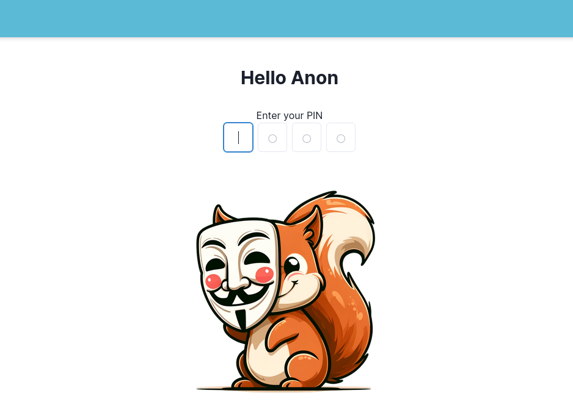

# zk Stealth


This project combines two complementary privacy technologies:
- **Stealth Addresses**: We can generate virtually unlimited addresses where users can receive funds.
  - We do not need the collaboration of the user to generate a new address, we can derive as much as we want from a single stealth address published on ENS.
  - They provide a convenient way to receive funds offering privacy to the sender.
- **Zero Knowledge Proofs**: We can prove to a smart contract pool that we own a specific address without revealing our identity.
  - They allow us to combine the funds received from a stealth address into a single address.
  - Hence, they provide a private way to receive funds.

The technologies used in this project are:
- [FluidKey](https://app.fluidkey.com/auth?code=U5U787), a tool to generate stealth addresses that received a prize in the EthRome Hackathon 2023. We use their `@fluidkey/stealth-account-kit` to generate and manage stealth addresses.
- [zkBob](https://app.zkbob.com), a tool to manage zk-SNARK proofs of deposits on privacy pools, very impressive and neeeded evolution of privacy wallets within Ethereum. We use their `zkbob-client-js` to generate and manage zkAccounts.


⚠️ **WARNING**: This project is a proof-of-concept developed during the [ETHBerlin](https://ethberlin.org/) hackathon 2024 and **not recommended for use in production**. It misses important features like the ability to create the Safe multisig of each stealth address using Account Abstraction, necessary to provide privacy.

## Getting Started

### Prerequisites

- [Node.js](https://nodejs.org/en/) >= 18.0.0
- [bun](https://bun.sh/) >= 1.0.0

### Installation

Clone the repository and install dependencies:

```sh
git clone https://github.com/sembrestels/zkStealth.git
cd zkStealth
bun install
```

### Running the app

```sh
bun dev
```

You can also build the app in production mode:

```sh
bun run build
```




### Usage

1. Enter in http://localhost:3000 and connect your wallet.
2. Insert a pin of 4 digits. If it is the same you used at the [fluidKey](https://app.fluidkey.com) app, the addresses will be generated.
3. Sign the message popup to login to fluidkey.
4. Sign the message popup to login to zkBob.
5. You will see the first 30 stealth addresses generated from fluidKey. You can generate as much as you want using the "Load more" button.
6. Send ETH to any of the stealth addresses generated (only on Optimism for now). You should see the balance updated in fluidKey.
7. If you update the page you will see the balance updated in the table as well. A new button will appear to send the ETH to the zkBob address.
8. Click on "Send {amount} ETH to zkBob" and accept the Metamask transaction to deploy a 1-of-1 Safe Multisig in this address.
    > **NOTE:** Ideally this should be done using a relayer, but for this proof-of-concept we are doing it directly.
9. Once the first transaction is confirmed, you will have to accept a second transaction in order to send ETH to the multisig owner.
    > **NOTE:** Again, this should be done using a relayer, but for this proof-of-concept we using a workaround.
10. After the second transaction is confirmed, the UI will perform a third transaction behind the scenes to send ETH to the zkBob account.
11. You should be able to see now your balance updated in the [zkBob](https://app.zkbob.com) app and in the table.
